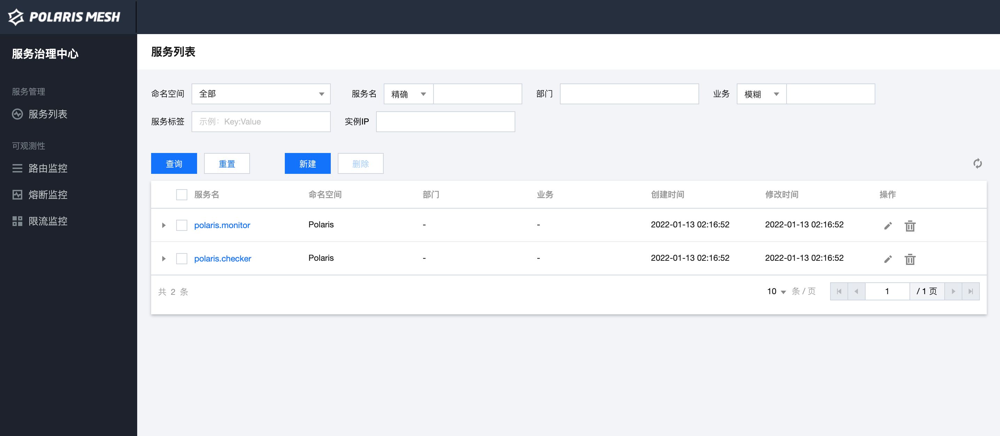

# Polaris helm

简体中文 | [English](./README.md)

本文档介绍如何使用 helm chart 安装 polaris 服务。

## 准备工作

确保已经安装 k8s 集群，且安装了 helm。

## 安装 polaris helm chart

### 安装单机版

您可以修改 `values.yaml` ，将 `global.mode` 设置为 `standalone` ，然后使用下面的命令安装，将 `${release_name}` 替换为您需要的 release 名。

```shell
$ cd deploy/helm
$ helm install ${release_name} . 
```

您可以可以直接使用下面的命令启动：

```shell
$ cd deploy/helm
$ helm install ${release_name} . --set global.mode=standalone
```

### 安装集群版

您需要修改 `values.yaml` ，将 `global.mode` 设置为 `cluster` ，同时设置 `polaris.storage.db` 和 `polaris.storaate.redis` 的地址信息。 确保您的
mysql 已经使用下面的命令初始化了。

```shell
mysql -u $db_user -p $db_pwd -h $db_host < store/sqldb/polaris_server.sql
```

设置好后，使用下面的命令安装 chart：

```shell
$ cd deploy/helm
$ helm install ${release_name} . 
```

### 检查安装

部署后可以通过以下命令观察到 pod 正常运行：

```shell
$ kubectl get po -n polaris-system
NAME                                  READY   STATUS    RESTARTS   AGE
polaris-0                             2/2     Running   0          2m44s
polaris-prometheus-6cd7cd5fc6-gqtcz   2/2     Running   0          2m44s
```

如果您在 `values.yaml` 中配置了 `service.type` 为 `LoadBalancer` 则可以使用 polaris 的 service 的 `EXTERNAL-IP`:webPort 访问到北极星的页面。 如果您的
k8s 集群不支持  `LoadBalancer` ，可以将 `service.type` 为 `NodePort` ，通过 nodeip:nodeport 访问。页面如下图：



## 卸载 polaris helm chart

使用下面命令卸载您安装的 release ，将 `${release_name}` 替换为您使用的 release 名。

```shell
$ helm uninstall `${release_name}`
```

## 配置

当前支持的配置如下：

| 参数名                                | 参数解释                              |
|--------------------------------------|--------------------------------------|
|global.mode                           | 集群类型，支持 `cluter` 和 `standalone` ，表示集群版和单机版|
|polaris.image.repository              | polaris-server 镜像仓库地址|
|polaris.image.tag                     | polaris-server 镜像 tag|
|polaris.image.pullPolicy              | polaris-server 镜像拉取策略|
|polaris.limit.cpu                     | polaris-server cpu资源占用限制|
|polaris.limit.memory                  | polaris-server 内存资源占用限制|
|polaris.console.image.repository      | polaris-console 的镜像仓库地址|
|polaris.console.image.tag             | polaris-console 镜像 tag|
|polaris.console.image.pullPolicy      | polaris-console 镜像拉取策略|
|polaris.console.limit.cpu             | polaris-console cpu资源占用限制|
|polaris.console.limit.memory          | polaris-console 内存资源占用限制|
|polaris.replicaCount                  | polaris 副本数|
|polaris.storage.db.address            | polaris 集群版，使用的 mysql 的地址|
|polaris.storage.db.name               | polaris 集群版，使用的 mysql 的 database 名|
|polaris.storage.db.user               | polaris 集群版，使用的 mysql 的用户名|
|polaris.storage.db.password           | polaris 集群版，使用的 mysql 的密码|
|polaris.storage.redis.address         | polaris 集群版，使用的 redis 的地址|
|polaris.storage.redis.password        | polaris 集群版，使用的 redis 的密码|
|polaris.storage.service.type          | polaris service 的类型|
|polaris.storage.service.httpPort      | polaris service 暴露，polaris-server 监听的 http 端口|
|polaris.storage.service.grpcPort      | polaris service 暴露，polaris-server 监听的 grpc 端口|
|polaris.storage.service.webPort       | polaris service 暴露，polaris-server 监听的 web 端口|
|polaris.auth.consoleOpen              | polaris 打开控制台接口鉴权，默认开启|
|polaris.auth.clientOpen               | polaris 打开客户端接口鉴权，默认关闭|
|monitor.port                          | 客户端上报监控信息的端口|
|installation.namespace                | 部署polaris组件所在的namespace|


