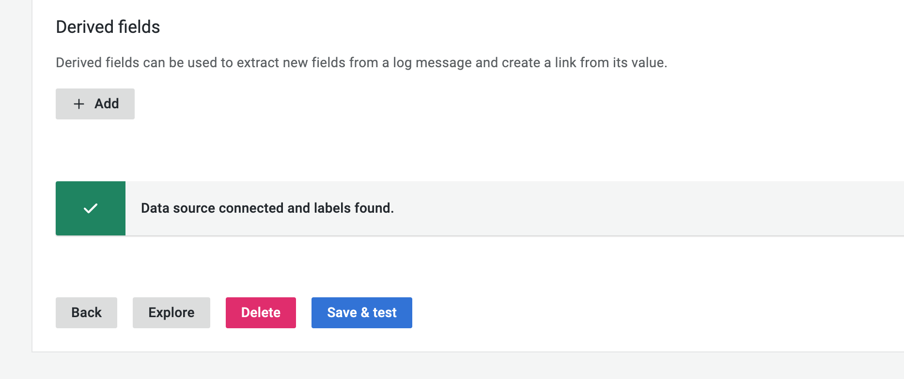
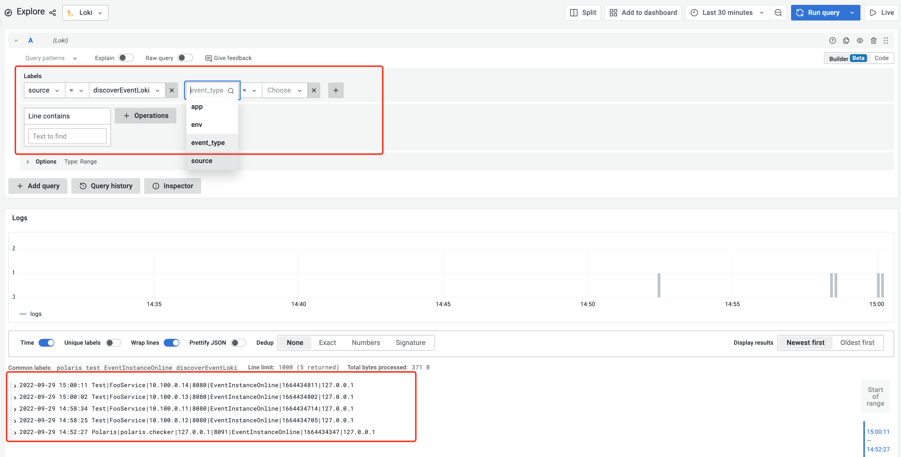

# 服务发现事件日志上报Loki插件

插件实现将服务事件日志发送到Loki日志系统，通过Grafana对Loki中的日志进行检索和可视化展示。

## 一、准备工作
### 安装部署loki

下载二进制包
```
$ curl -O -L "https://github.com/grafana/loki/releases/download/v2.6.1/loki-linux-amd64.zip"
# extract the binary
$ unzip "loki-linux-amd64.zip"
# make sure it is executable
$ chmod a+x "loki-linux-amd64"
```
下载配置文件
```
$ wget https://raw.githubusercontent.com/grafana/loki/v2.6.0/cmd/loki/loki-local-config.yaml
```
启动Loki
```
$ nohup ./loki-linux-amd64 -config.file=loki-local-config.yaml > ./loki.log 2>&1 &
```
更多安装方式请参考 [Loki官方安装文档](https://grafana.com/docs/loki/latest/installation/)

### 安装部署Grafana
RPM包安装
```
$ wget https://dl.grafana.com/enterprise/release/grafana-enterprise-9.1.6-1.x86_64.rpm
$ sudo yum install grafana-enterprise-9.1.6-1.x86_64.rpm
```
启动Grafana服务
```
$ sudo systemctl daemon-reload
$ sudo systemctl start grafana-server
$ sudo systemctl status grafana-server
```
更多安装方式请参考 [Grafana官方安装文档](https://grafana.com/docs/grafana/latest/setup-grafana/installation/)

## 二、插件配置与使用
在 polaris-server.yaml 配置文件中，插件配置部分，discoverEvent插件配置块设置如下配置：

```YAML
plugin:
  discoverEvent:
    name: discoverEventLoki                              # [必填]插件名称
    option:
      queueSize: 1024                                    # [必填]日志缓存队列长度
      pushURL: http://127.0.0.1:3100/loki/api/v1/push    # [必填]loki push 接口地址
      tenantID: "test"                                   # [可选]设置loki日志租户
      labels:                                            # [可选]自定义日志标签
        key1: "value1"
        key2: "value2"
```
polaris-server启动后，会根据配置文件加载插件，服务发现事件会通过插件上报到Loki日志系统。

## 三、Grafana查询Loki日志

### Grafana配置Loki数据源
在Grafana页面中点击配置图标，点击数据源，添加Loki数据源：
- Name: 设置数据源名字
- URL: 设置Loki实例的地址


配置完成后在页面底部点击保存&测试按钮，如果Loki系统正在运行，并且有日志上报到系统，会提示数据源已连接并发现标签。



### 查询Loki日志
点击Explore按钮查询Loki日志，可根据标签进行日志筛选，插件默认会设置`source`和`event_type`两个标签，`source`取值为插件名称`discoverEventLoki`，`event_type`为服务发现事件类型。



更多配置和使用请参考 [在Grafana中使用Loki](https://grafana.com/docs/grafana/latest/datasources/loki/)

